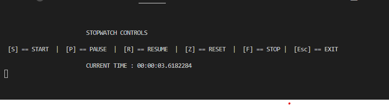

# SGW
Virtual and Augmented Reality Specialization Group work. 

## STOP WATCH MECHANISM

----
### TASKS/FUNCTIONALITIES

1. The time format should be 00:00:00 for (hours:mins:secs)
2. The start button should start the watch from the secs and adds up to minutes and hours
3. The pause button should pause the stopwatch and prints its current value to the console or display the current value
4. The resume button should continue the stopwatch from when it was paused
5. The reset button should set the watch back to 00:00:00
6. The stop button should stop the watch and display the last read value

### DOCUMENTATION
---

### UNIT TEST
---
